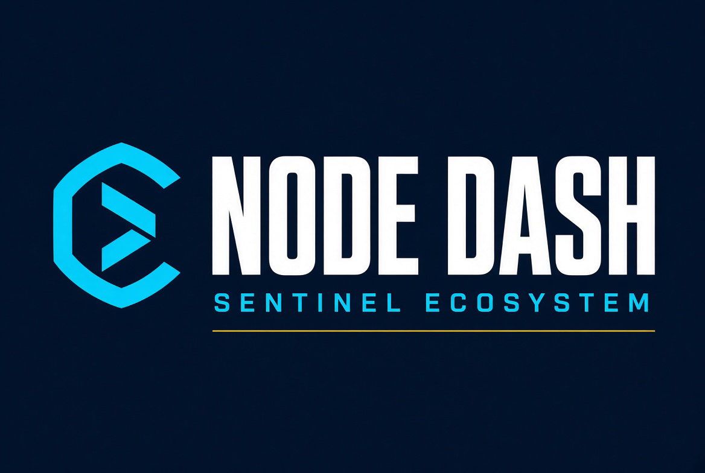

# Sentinel Node Dash 


An arcade endless-runner that teaches the Sentinel dVPN ecosystem while you play — powered by live node data.

**▶ Play: https://superpios.github.io/sentinel-node-dash/**

## What it is

You are a data packet running through the Sentinel decentralized bandwidth network.

- ⚡ **Collect real nodes.** Every node orb is a live Sentinel node pulled from the [Node Scorecard](https://superpios.github.io/node-scorecard/) — real moniker, real country, real download speed, real protocol (WireGuard and V2Ray today, plus the first Xray, Hysteria2 and AmneziaWG pioneer nodes), and an official **SLA ✓** badge when a node has passed the network's real-world speed test.
- ⭐ **Score multipliers reflect the Scorecard `hosting` flag.** Nodes with `hosting === false` (not classified as a datacenter ASN) give a **2.4×** score bonus. Datacenter nodes give a **1.2×** bonus. This is the Scorecard field, not the stricter verified-residential check (geo-IP + non-hosting ASN) documented in the Scorecard README.
- 🔥 **Combo and near-miss.** Nodes collected without taking a hit raise a combo multiplier. Passing close to a brick without touching it scores a near-miss bonus. A hit resets the combo; it does not have to end the run.
- ⚠️ **Dodge bricks that play differently.** DPI sits high (needs a double jump), trackers stay low and move faster, geo-blocks float and weave.
- 📋 **One contract per run.** At start the game picks a short goal (3 Italy nodes, 2 SLA✓ nodes, an 8-node combo, or 4 topics). Finish it for +1 $P2P and a brief score boost. Speed rises with distance only — collecting nodes does not accelerate the run.
- 🧠 **Learn while you play — 36 topics.** A short tutorial shows the controls at the start of every run. Every few stars a new topic is revealed, followed by a quiz. Answer correctly and you earn bonus $P2P and score — or, on technical topics (protocols, privacy, security, node types, AI-agent payments), a temporary **power-up**: ⛨ **WireGuard Mode** (5 seconds of invincibility) or ⚡ **P2P Boost** (12 seconds of double score).

Topics cover:

- **dVPN apps:** Sentinel Shield, Independent VPN, Ryn VPN, DVPN by NORSE, VALT, Meile, ChibaTunnel, Veil DVPN, Katacomb VPN
- **Tools and explorers:** BlueCLI, P2PScan, SuchNode, Network Stats, Node Scorecard
- **Agent APIs:** [x402.sentinel.co](https://x402.sentinel.co/) (dVPN tunnels for agents) and [nodescorecard.xyz](https://nodescorecard.xyz) (node intelligence over x402, including the PayAI facilitator and Solana USDC payments with sponsored fees)
- **Community:** Bluefrens
- **Core concepts:** on-chain sessions, $P2P, WireGuard/V2Ray, the new anti-censorship protocol wave, official SLA tests, the planned $P2P migration to Solana ($P2P remains the token; official timing is later in the year / before year end)

Each topic — and its quiz — appears only once per run. Once you've seen them all, stars become a silent bonus plus a short boost, and the game stops interrupting you.

> **Note on in-game currency:** any mention of $P2P within the game (multipliers, values) is purely educational and represents virtual points — no real cryptocurrency is earned, paid out, or expected.

## Controls

| Action | Keys |
|---|---|
| Jump (double jump!) | `Space` · `↑` · `W` · tap / click |
| Pause | `P` · `Esc` |
| Restart run | `R` (while paused or on game over) |
| Main menu | `M` (while paused or on game over) |
| Start | `Enter` |

Three player skins, each with one effect:

- **Data Packet** — higher jump
- **dVPN Shield** — WireGuard invincibility lasts +0.4s
- **$P2P Coin** — +10% score

## Tech

- **Single HTML file.** No build step, no framework, no CDN, no dependencies.
- **One outbound request, ever:** the public Node Scorecard JSON. Nothing else leaves your browser.
- **No tracking, no analytics, no cookies, no accounts.** The only thing stored is your high score, kept in `localStorage` on your own device — it is never sent anywhere, and clearing your site data wipes it.
- **Audio is synthesized in-browser** with the Web Audio API — no media files.
- **All artwork is original vector art** drawn on `<canvas>`. No third-party logo or trademark file is embedded.
- **Falls back to demo node data** if the Scorecard is unreachable, so the game always runs. The menu tells you which mode you're in (● LIVE or ○ Offline).

## Run locally

```bash
git clone https://github.com/superpios/sentinel-node-dash.git
cd sentinel-node-dash
python3 -m http.server 8080
# open http://localhost:8080
```

Serve it over HTTP rather than opening `index.html` straight from disk — a `file://` page can't fetch the live node data, so you'd only get the demo fallback.

## Data source

Live node data comes from [Node Scorecard](https://superpios.github.io/node-scorecard/), an open dashboard tracking speed, uptime, protocol and reliability across the Sentinel network.

Machine-payable copy of the same measurements: [nodescorecard.xyz](https://nodescorecard.xyz) (x402, USDC, no API key).

## Learn more about Sentinel

- [sentinel.co](https://sentinel.co) — build your own dVPN
- [dVPN apps](https://docs.sentinel.co/get-started/apps) — official client list (includes Veil DVPN and Katacomb VPN)
- [Run a node](https://docs.sentinel.co/dvpn-node-setup) and earn real $P2P as a node operator
- [x402.sentinel.co](https://x402.sentinel.co/) — dVPN for AI agents
- [nodescorecard.xyz](https://nodescorecard.xyz) — node intelligence API for AI agents
- [P2PScan](https://p2pscan.com/) — every session and payment, on-chain and public

## Disclaimer

This is an unofficial, community-made project. It is not affiliated with, endorsed by, or sponsored by Sentinel P2P or by any of the applications it links to. All product names and links belong to their respective owners and are referenced here for educational purposes only. No third-party logos or brand assets are used — every graphic in the game is original.

No real cryptocurrency is distributed by this game. All in-game references to $P2P are purely educational and represent virtual points.

## Contributing

Found a factual error about the Sentinel ecosystem, or a broken link? Open an issue — accuracy matters more than polish here.

## License

MIT — see [LICENSE](LICENSE).
